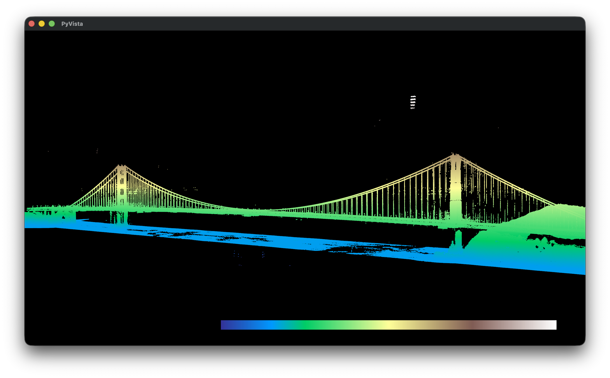

# LIDAR Lookup

Find 3DEP LIDAR LAZ file URLs for a bounding box or GPS point. 

Uses the [National Map 3DEP Elevation Index](https://index.nationalmap.gov/arcgis/rest/services/3DEPElevationIndex/MapServer/24) API and resolves rockyweb directory links to LAZ URLs.  Creates indexes if necessary.

By default lists URLs only; use **`--download`** to download each file. 

## Usage

### List LIDAR LAZ Files 
```bash
❯ lidar-lookup --json samples/golden-gate-bridge.json
https://rockyweb.usgs.gov/vdelivery/Datasets/Staged/Elevation/LPC/Projects/CA_SanFrancisco_B23/CA_SanFrancisco_1_B23/LAZ/USGS_LPC_CA_SanFrancisco_B23_04500305.laz
https://rockyweb.usgs.gov/vdelivery/Datasets/Staged/Elevation/LPC/Projects/CA_SanFrancisco_B23/CA_SanFrancisco_1_B23/LAZ/USGS_LPC_CA_SanFrancisco_B23_04500310.laz
https://rockyweb.usgs.gov/vdelivery/Datasets/Staged/Elevation/LPC/Projects/CA_SanFrancisco_B23/CA_SanFrancisco_1_B23/LAZ/USGS_LPC_CA_SanFrancisco_B23_04500315.laz
https://rockyweb.usgs.gov/vdelivery/Datasets/Staged/Elevation/LPC/Projects/CA_SanFrancisco_B23/CA_SanFrancisco_1_B23/LAZ/USGS_LPC_CA_SanFrancisco_B23_04500320.laz
https://rockyweb.usgs.gov/vdelivery/Datasets/Staged/Elevation/LPC/Projects/CA_SanFrancisco_B23/CA_SanFrancisco_1_B23/LAZ/USGS_LPC_CA_SanFrancisco_B23_04500325.laz
https://rockyweb.usgs.gov/vdelivery/Datasets/Staged/Elevation/LPC/Projects/CA_SanFrancisco_B23/CA_SanFrancisco_1_B23/LAZ/USGS_LPC_CA_SanFrancisco_B23_04550305.laz
https://rockyweb.usgs.gov/vdelivery/Datasets/Staged/Elevation/LPC/Projects/CA_SanFrancisco_B23/CA_SanFrancisco_1_B23/LAZ/USGS_LPC_CA_SanFrancisco_B23_04550310.laz
https://rockyweb.usgs.gov/vdelivery/Datasets/Staged/Elevation/LPC/Projects/CA_SanFrancisco_B23/CA_SanFrancisco_1_B23/LAZ/USGS_LPC_CA_SanFrancisco_B23_04550315.laz
https://rockyweb.usgs.gov/vdelivery/Datasets/Staged/Elevation/LPC/Projects/CA_SanFrancisco_B23/CA_SanFrancisco_1_B23/LAZ/USGS_LPC_CA_SanFrancisco_B23_04550320.laz
https://rockyweb.usgs.gov/vdelivery/Datasets/Staged/Elevation/LPC/Projects/CA_SanFrancisco_B23/CA_SanFrancisco_1_B23/LAZ/USGS_LPC_CA_SanFrancisco_B23_04550325.laz
```

Example: loading multiple LAZ files (e.g. after downloading tiles for Golden Gate Bridge) and opening the 3D viewer:

```bash
❯ lidar-lookup USGS_LPC_CA_SanFrancisco_B23_045*
Reading USGS_LPC_CA_SanFrancisco_B23_04500305.laz ...
Loaded 730,503 points
Building point cloud USGS_LPC_CA_SanFrancisco_B23_04500305.laz (730,503 points, color=elevation) ...
Reading USGS_LPC_CA_SanFrancisco_B23_04500310.laz ...
Loaded 647,852 points
Building point cloud USGS_LPC_CA_SanFrancisco_B23_04500310.laz (647,852 points, color=elevation) ...
Reading USGS_LPC_CA_SanFrancisco_B23_04500315.laz ...
Loaded 2,776,218 points
Building point cloud USGS_LPC_CA_SanFrancisco_B23_04500315.laz (2,776,218 points, color=elevation) ...
Reading USGS_LPC_CA_SanFrancisco_B23_04500320.laz ...
Loaded 5,241,349 points
Building point cloud USGS_LPC_CA_SanFrancisco_B23_04500320.laz (5,241,349 points, color=elevation) ...
Reading USGS_LPC_CA_SanFrancisco_B23_04500325.laz ...
Loaded 13,940,892 points
Building point cloud USGS_LPC_CA_SanFrancisco_B23_04500325.laz (13,940,892 points, color=elevation) ...
Reading USGS_LPC_CA_SanFrancisco_B23_04550305.laz ...
Loaded 10,313,404 points
Building point cloud USGS_LPC_CA_SanFrancisco_B23_04550305.laz (10,313,404 points, color=elevation) ...
Reading USGS_LPC_CA_SanFrancisco_B23_04550310.laz ...
Loaded 3,081,617 points
Building point cloud USGS_LPC_CA_SanFrancisco_B23_04550310.laz (3,081,617 points, color=elevation) ...
Reading USGS_LPC_CA_SanFrancisco_B23_04550315.laz ...
Loaded 1,045,606 points
Building point cloud USGS_LPC_CA_SanFrancisco_B23_04550315.laz (1,045,606 points, color=elevation) ...
Reading USGS_LPC_CA_SanFrancisco_B23_04550320.laz ...
Loaded 369,818 points
Building point cloud USGS_LPC_CA_SanFrancisco_B23_04550320.laz (369,818 points, color=elevation) ...
Reading USGS_LPC_CA_SanFrancisco_B23_04550325.laz ...
Loaded 301,006 points
Building point cloud USGS_LPC_CA_SanFrancisco_B23_04550325.laz (301,006 points, color=elevation) ...
Opening viewer (close the window to exit) ...
```




## Install

```bash
pip install lidar-lookup
```

Optional 3D display for LAZ/LAS files:

```bash
pip install lidar-lookup[display]
```

## Run locally (from source)

From the repo root:

```bash
# Create venv and install the package in editable mode
uv sync
```

Then run the CLI in one of these ways:

**Using `uv run` (no activation needed):**

```bash
uv run lidar-lookup --bbox 37.810 -122.479255 37.828 -122.477255
uv run lidar-lookup samples/golden-gate-bridge.json --filenames
```


## Usage

When you run `lidar-lookup` (or call `list_lidar_urls`), the 3DEP API and rockyweb file links are used to find projects. When multiple projects cover your area, the tool picks a single project to use (newest collection year from the project path, preferring non-legacy). By default, per-project metadata indexes are built from XML (and cached under **`LIDAR_CACHE_DIR`**, default `inputs/cache/`) so only LAZ tiles that intersect your bbox or point are returned. Use **`-v`** or **`--verbose`** for debug output (3DEP query, chosen project, per-project index status). Use **`--no-filter-tiles`** to list all LAZ files in each project instead.

### Python API

```python
from lidar_lookup import list_lidar_urls, parse_bbox, point_to_bbox, query_3dep_index, lpc_link_to_laz_urls

# From a WGS84 bbox (minx, miny, maxx, maxy) — lon, lat
urls = list_lidar_urls((-122.479255, 37.810, -122.477255, 37.828))

# From a single point (lon, lat): exact point query by default (like url.sh)
urls = list_lidar_urls((-122.478255, 37.819023))
# Or use a small bbox around the point (e.g. 0.001 deg ~220 m)
urls = list_lidar_urls((-122.478255, 37.819023), point_buffer_degrees=0.001)

# From JSON: dict, string, or path to .json file
urls = list_lidar_urls({"bbox": [-122.479255, 37.810, -122.477255, 37.828]})
urls = list_lidar_urls("bbox.json")
urls = list_lidar_urls('[-122.479255, 37.810, -122.477255, 37.828]')

# Default: only tiles whose extent intersects the query (per-project index)
urls = list_lidar_urls((-122.478255, 37.819023))
# List all project LAZ URLs (no bbox filter)
urls = list_lidar_urls((-122.478255, 37.819023), filter_tiles_by_bbox=False)

# Supported JSON bbox formats:
#   [minx, miny, maxx, maxy]
#   {"bbox": [minx, miny, maxx, maxy]}
#   {"minx": n, "miny": n, "maxx": n, "maxy": n}
#   {"type": "bbox", "coordinates": [minx, miny, maxx, maxy]}

# Low-level: query 3DEP then resolve each project's LAZ list
features = query_3dep_index((-122.479255, 37.810, -122.477255, 37.828))
for f in features:
    laz_urls = lpc_link_to_laz_urls(f["lpc_link"])
```

### CLI

Use **`-v`** (or **`--verbose`**) to print debug messages: 3DEP bbox query, projects returned, which project was chosen, and per-project index file found/missing.

```bash
# Bbox as four numbers (minx miny maxx maxy)
lidar-lookup --bbox 37.810 -122.479255 37.828 -122.477255

# Single point or bbox: only LAZ tiles that intersect (default; uses per-project index)
lidar-lookup --point 37.819023 -122.478255
lidar-lookup samples/gateway-arch.json
# List all LAZ files in each project (no bbox filter)
lidar-lookup samples/gateway-arch.json --no-filter-tiles
# Expand to a small bbox around point (~220 m with 0.001 deg)
lidar-lookup --point 37.819023 -122.478255 --point-buffer 0.001
lidar-lookup --point 37.819023 -122.478255 --point-buffer 0.01

# Bbox from JSON file or literal
lidar-lookup bbox.json
lidar-lookup --json '{"bbox": [-122.479255, 37.810, -122.477255, 37.828]}'
lidar-lookup --json '[-122.479255, 37.810, -122.477255, 37.828]'
echo '{"bbox": [-122.479255, 37.810, -122.477255, 37.828]}' | lidar-lookup -

# Output options
lidar-lookup --bbox 37.810 -122.479255 37.828 -122.477255 --filenames
lidar-lookup --bbox 37.810 -122.479255 37.828 -122.477255 -o urls.txt

# Download each LAZ file to the current directory (or --download-dir)
lidar-lookup samples/golden-gate-bridge.json --download
lidar-lookup --bbox 37.810 -122.479255 37.828 -122.477255 --download --download-dir ./laz_files

# Bbox: filtered by default; use --no-filter-tiles to list all project URLs
lidar-lookup --bbox 37.810 -122.479255 37.828 -122.477255

# Display one or more LAZ/LAS files in a 3D viewer (requires [display] extra)
lidar-lookup path/to/file.laz
lidar-lookup file1.laz file2.laz file3.las   # multiple files in one view
# --display is optional when passing .laz/.las as arguments:
lidar-lookup --display path/to/file.laz      # same as above
# Add pin(s) at (lat, lon) or (lat, lon, z) in WGS84 (z sampled from point cloud if omitted):
lidar-lookup file.laz --pin 39.367 -86.788
lidar-lookup file.laz --pin 39.367 -86.788 200
```

### Sample locations

Included JSON samples (use from the repo root or point to `samples/`):

| Location | JSON file | Point (lat, lon) |
|----------|-----------|------------------|
| Golden Gate Bridge (south tower) | `samples/golden-gate-bridge.json` | 37.819023, -122.478255 |
| Gateway Arch, St. Louis | `samples/gateway-arch.json` | 38.624626, -90.185099 |
| Washington Monument, DC | `samples/washington-monument.json` | 38.889467, -77.035072 |

```bash
lidar-lookup samples/golden-gate-bridge.json --filenames
lidar-lookup --point 37.819023 -122.478255   # Golden Gate Bridge
lidar-lookup --point 38.624626 -90.185099   # Gateway Arch
lidar-lookup --point 38.889467 -77.035072   # Washington Monument
```

## Per-project indexes (created only when missing)

Indexes are built from current 3DEP LIDAR data. For the sample areas (Golden Gate Bridge, Gateway Arch, Washington Monument), the results and any cached indexes in this repo reflect the LIDAR catalog as it was when this code was created; the live catalog may change over time.

By default, each project’s metadata index is built on first use and cached under **`LIDAR_CACHE_DIR`** (default `inputs/cache/`). With `-v` you’ll see `per-project index file found --- <path>` when loading from cache, or `per-project index file missing --- <path>` when building from XML. Use `--no-filter-tiles` to skip the index and list all LAZ URLs for the project.

### Environment variables

| Variable | Default | Description |
|----------|---------|-------------|
| `LIDAR_CACHE_DIR` | `inputs/cache` | Directory where per-project metadata indexes are cached when using tile filtering. |

## Publishing to PyPI

```bash
pip install build twine
python -m build
twine upload dist/*
```

## License

MIT
